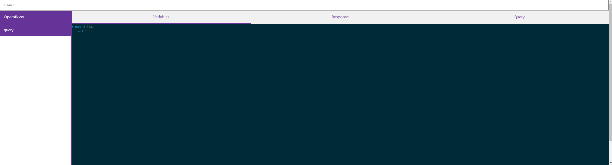
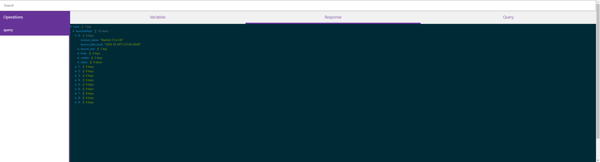
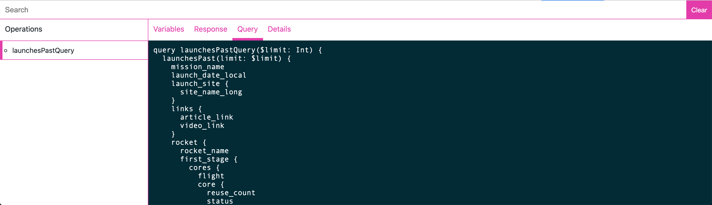

# GraphQL Request Inspector

## Screenshots

📷

## Installation

`git clone https://github.com/tkorakas/graphql-inspector-extension.git`

## Build

- `yarn`
- `yarn build`

## Roadmap

- [ ] GitHub actions
- [ ] Dependabot
- [ ] Release to store
- [ ] Search patterns
- [ ] Copy query
- [ ] Open to Graphiql