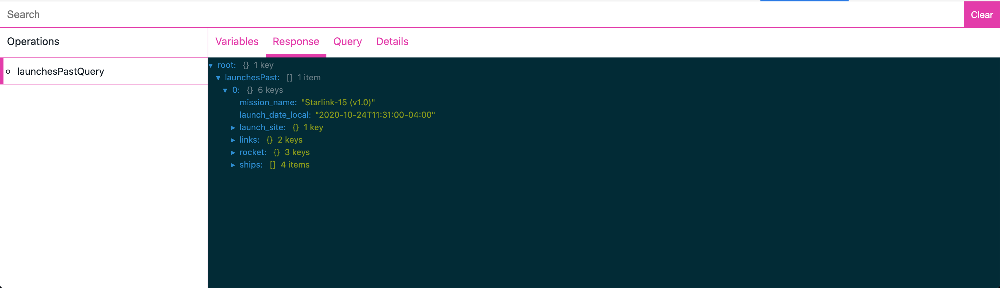

# GraphQL Request Inspector

## Screenshots

📷

## Installation

- Download and unzip the latest [release](https://github.com/tkorakas/graphql-inspector-extension/releases/latest)
- Open Chrome and go to "chrome://extensions"
- Enable developer mode from the top right corner
- Click to "Load unpacked" button and browse the dist folder you unzipped on the first step

## Build

- `git clone https://github.com/tkorakas/skroutz-common-stores/releases/latest`
- `yarn`
- `yarn build`

## Roadmap

- [x] GitHub actions
- [ ] Dependabot
- [ ] Release to store
- [ ] Search patterns
- [ ] Copy query
- [ ] Open to Graphiql
